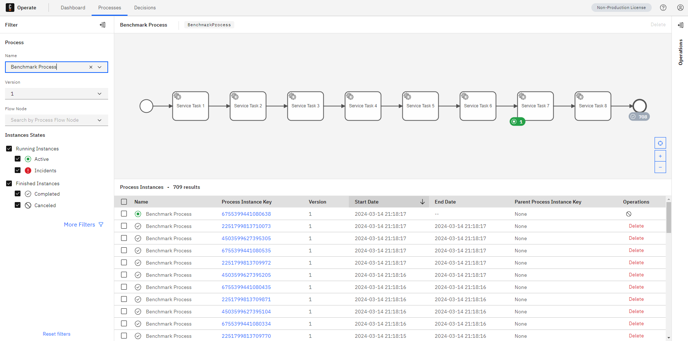
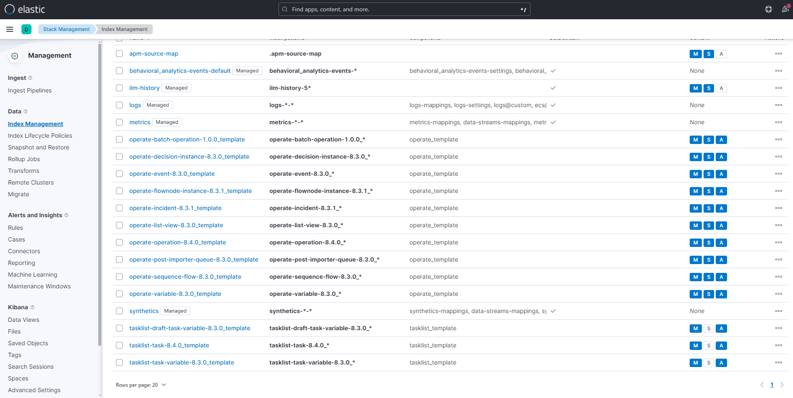
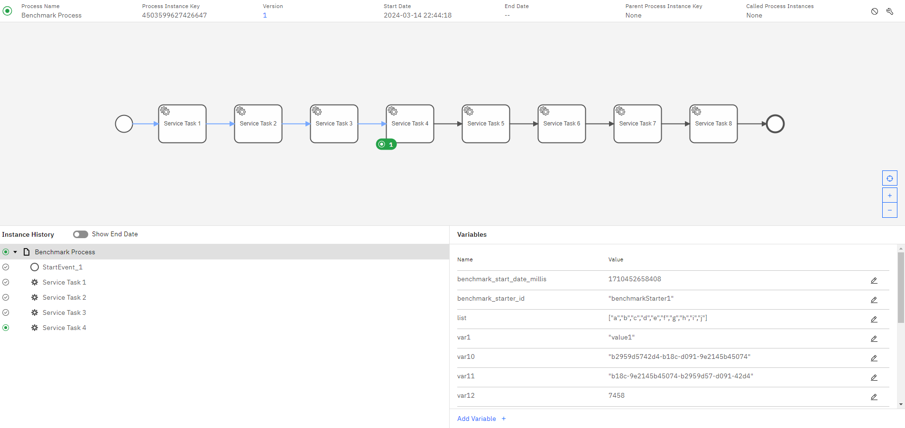
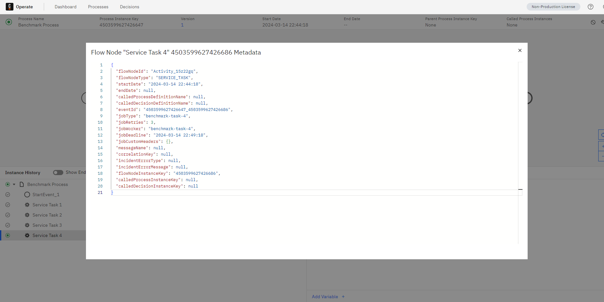

# Content Moved to https://github.com/camunda-consulting/c8-devops-workshop/tree/main/03%20-%20Lab%203%20-%20Backup%20and%20Restore


# Trigger Backup and Restore

## Create Demo Environment

### Create Minio

```
helm install minio oci://registry-1.docker.io/bitnamicharts/minio -f minio-values.yaml
```

### Install Camunda

```
helm install camunda camunda/camunda-platform -f camunda-values.yaml
```

### Wait for ES to be ready
```
kubectl rollout status sts/camunda-elasticsearch-master
```

### Register Snapshot Repositories
```
kubectl apply -f es-snapshot-minio-job.yaml
```
```
kubectl logs -f $(kubectl get pods --selector=job-name=es-snapshot-minio-job --output=jsonpath='{.items[*].metadata.name}' | awk '{print $1}') 
```

### Generate Data

```
wget https://raw.githubusercontent.com/camunda-community-hub/camunda-8-helm-profiles/c09d5f91504302e166f87fb95119f29efadc165f/bpmn/BenchmarkProcess.bpmn
```

```
kubectl create configmap models --from-file=CamundaProcess.bpmn=BenchmarkProcess.bpmn
```

```
kubectl apply -f https://raw.githubusercontent.com/camunda-community-hub/camunda-8-helm-profiles/c09d5f91504302e166f87fb95119f29efadc165f/include/zbctl-deploy-job.yaml 
```
```
kubectl logs -f $(kubectl get pods --selector=job-name=zbctl-deploy --output=jsonpath='{.items[*].metadata.name}' | awk '{print $1}') 
```

```
wget https://raw.githubusercontent.com/camunda-community-hub/camunda-8-helm-profiles/main/benchmark/payload.json
```

```
kubectl create configmap payload --from-file=payload.json
```

```
kubectl apply -f https://raw.githubusercontent.com/camunda-community-hub/camunda-8-helm-profiles/main/benchmark/benchmark.yaml
```

### Stop Data Generation

```
kubectl delete deploy benchmark
```

### Review Current State



## Perform Backup
### Generate BackupId
```
./create-backupId-as-secret.sh
```

### Trigger Backup for Operate, Tasklist and Optimize

```
kubectl apply -f camunda-backup-job.yaml
```

```
kubectl logs -f $(kubectl get pods --selector=job-name=camunda-backup-job --output=jsonpath='{.items[*].metadata.name}' | awk '{print $1}') 
```
### Pause Exporting

```
kubectl apply -f zeebe-export-pause.yaml
```

### Backup of Zeebe Records in ES
```
kubectl apply -f es-create-snapshot-zeebe.yaml
```
```
kubectl logs -f $(kubectl get pods --selector=job-name=es-create-snapshot-zeebe --output=jsonpath='{.items[*].metadata.name}' | awk '{print $1}') 
```

### Zeebe Backup
```
kubectl apply -f zeebe-backup-job.yaml
```
```
kubectl logs -f $(kubectl get pods --selector=job-name=zeebe-backup-job --output=jsonpath='{.items[*].metadata.name}' | awk '{print $1}') 
```

### (Optional not required for the Demo) Resume Exporting

```
kubectl apply -f zeebe-export-resume.yaml
```

## Simulate Data Loss

```
helm delete camunda
```
```
kubectl delete pvc data-camunda-elasticsearch-master-0 data-camunda-elasticsearch-master-1 data-camunda-postgresql-0 data-camunda-zeebe-0 data-camunda-zeebe-1 data-camunda-zeebe-2
```

## Restore
### Create New Camunda Cluster

```
helm install camunda camunda/camunda-platform -f camunda-values.yaml
```

```
kubectl rollout status deploy/camunda-operate
```

Why? Templates and Aliases are created again.

### Verify that Templates are generated.



### Scale Down Zeebe & Webapps.
```
kubectl scale sts/camunda-zeebe --replicas=0
```

```
kubectl scale deploy/camunda-zeebe-gateway --replicas=0
```

```
kubectl scale deploy/camunda-operate --replicas=0
```

```
kubectl scale deploy/camunda-tasklist --replicas=0
```

```
kubectl scale deploy/camunda-optimize --replicas=0
```

### Register ES Repositories again
```
kubectl delete job es-snapshot-minio-job
kubectl apply -f es-snapshot-minio-job.yaml
```
### Delete all Indices
```
kubectl apply -f restore/es-delete-all-indices.yaml
```

### Restore Snapshots
```
kubectl apply -f restore/es-snapshot-restore-job.yaml
```

### Restore Zeebe
```
kubectl apply -f restore/zeebe-restore-job-0.yaml
```

```
kubectl logs -f $(kubectl get pods --selector=job-name=zeebe-restore-job-0 --output=jsonpath='{.items[*].metadata.name}' | awk '{print $1}') 
```

```
kubectl apply -f restore/zeebe-restore-job-1.yaml
```
```
kubectl logs -f $(kubectl get pods --selector=job-name=zeebe-restore-job-1 --output=jsonpath='{.items[*].metadata.name}' | awk '{print $1}') 
```
```
kubectl apply -f restore/zeebe-restore-job-2.yaml
```
```
kubectl logs -f $(kubectl get pods --selector=job-name=zeebe-restore-job-2 --output=jsonpath='{.items[*].metadata.name}' | awk '{print $1}') 
```

```
kubectl delete jobs zeebe-restore-job-0 zeebe-restore-job-1 zeebe-restore-job-2
```

### Scale up Zeebe again
```
kubectl scale sts/camunda-zeebe --replicas=3
```
```
kubectl rollout status sts/camunda-zeebe
```
```
kubectl scale deploy/camunda-zeebe-gateway --replicas=2
```
```
kubectl port-forward svc/camunda-zeebe-gateway 26500
```
```
zbctl status --insecure
```

### Scale up Operate again
```
kubectl scale deploy/camunda-operate --replicas=1
```
### Scale up Tasklist again
```
kubectl scale deploy/camunda-tasklist --replicas=1
```
### Scale up Optimize again
```
kubectl scale deploy/camunda-optimize --replicas=1
```

# Validate Restore

## Operate:


## Zeebe:
### Find an active Instance



### Check JobType


```
{
	"flowNodeId": "Activity_15z22gq",
	"flowNodeType": "SERVICE_TASK",
	"startDate": "2024-03-14 22:44:18",
	"endDate": null,
	"calledProcessDefinitionName": null,
	"calledDecisionDefinitionName": null,
	"eventId": "4503599627426647_4503599627426686",
	"jobType": "benchmark-task-4",
	"jobRetries": 3,
	"jobWorker": "benchmark-task-4",
	"jobDeadline": "2024-03-14 22:49:18",
	"jobCustomHeaders": {},
	"messageName": null,
	"correlationKey": null,
	"incidentErrorType": null,
	"incidentErrorMessage": null,
	"flowNodeInstanceKey": "4503599627426686",
	"calledProcessInstanceKey": null,
	"calledDecisionInstanceKey": null
}
```
```
kubectl port-forward svc/camunda-zeebe-gateway 26500
```
```
zbctl activate jobs benchmark-task-4 --insecure
```

```
{
  "jobs":  [
    {
      "key":  "2251799813685259",
      "type":  "benchmark-task-4",
      ...
    }
  ]
}
```

# Cleanup
```
kubectl delete jobs $(kubectl get jobs --no-headers -o custom-columns=":metadata.name,:status.conditions[?(@.type=='Complete')].status" | grep True | cut -d" " -f1)
```
```
kubectl delete pvc data-camunda-elasticsearch-master-0 data-camunda-elasticsearch-master-1 data-camunda-postgresql-0 data-camunda-zeebe-0 data-camunda-zeebe-1 data-camunda-zeebe-2 minio
```
